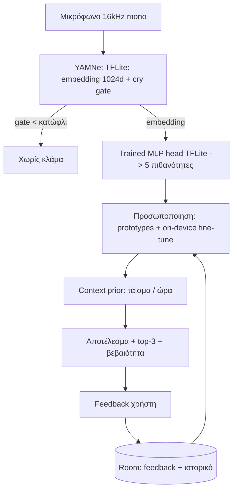

# Γιατί Κλαίει; - Baby Cry Analyzer

Android εφαρμογή που ηχογραφεί το κλάμα του μωρού (Shazam-style, με το πάτημα ενός κουμπιού)
και εκτιμά **γιατί** κλαίει: πείνα, κούραση, δυσφορία, κοιλόπονος/αέρια ή ρέψιμο. Μαθαίνει
από τις δικές σου διορθώσεις και βελτιώνεται με τον καιρό - όλα **τοπικά στο κινητό**.

> Ενημερωτικό βοήθημα, ΟΧΙ ιατρική συσκευή. Για ανησυχίες υγείας, ρώτησε παιδίατρο.

## Τι κάνει

- Ηχογράφηση κατ' απαίτηση (χωρίς background), ζωντανό «μετρητή» έντασης.
- Ανίχνευση κλάματος (gate) + κατηγοριοποίηση αιτίας με AI μοντέλο.
- «Δεν είμαι σίγουρο» (OOD) όταν η βεβαιότητα είναι χαμηλή.
- Feedback: επιβεβαίωσε ή διόρθωσε την πρόβλεψη -> το μοντέλο προσαρμόζεται σε σένα.
- Ιστορικό/timeline με μοτίβα ανά ώρα και καταγραφή «τάισμα τώρα».
- Context prior: σταθμίζει το αποτέλεσμα με ώρες από το τελευταίο τάισμα και ώρα ημέρας.
- Στατιστικά ακρίβειας (accuracy, recall ανά κατηγορία, πίνακας σύγχυσης) + εξαγωγή CSV.

## Πώς δουλεύει (αρχιτεκτονική)

Μοντέλο = **Supervised Deep Learning (transfer learning)**: το YAMNet (προεκπαιδευμένο σε
AudioSet) δίνει ένα 1024-d embedding, και ένα μικρό MLP «head» εκπαιδεύεται από εμάς πάνω
στα δημόσια datasets κλάματος. Το ίδιο YAMNet τρέχει και στο κινητό, ώστε τα χαρακτηριστικά
inference να ταιριάζουν ακριβώς με της εκπαίδευσης (parity test το επιβεβαιώνει).

## Δομή του project

- `ml-training/` - Python pipeline (τρέχει σε Google Colab) που παράγει τα μοντέλα TFLite.
  Δες [ml-training/README.md](ml-training/README.md).
- `app/` - το Android app (Kotlin + Jetpack Compose).

## Βήμα 1: Εκπαίδευση μοντέλου (Google Colab)

Δεν χρειάζεται Python/GPU στον υπολογιστή σου.

1. Ανέβασε το project σε (ιδιωτικό) GitHub repo.
2. Άνοιξε το [ml-training/train_baby_cry.ipynb](ml-training/train_baby_cry.ipynb) στο Colab.
3. Βάλε το `REPO_URL` και τρέξε όλα τα κελιά. (Προαιρετικά ανέβασε `kaggle.json` για
   περισσότερα δεδομένα.)
4. Κατέβασε το `artifacts/model_bundle.zip`.

Παράγει: `cry_reason.tflite`, `yamnet.tflite`, `labels.txt`, `cry_reason_trainable.tflite`,
και γραφήματα αξιολόγησης (confusion matrix, ROC/PR, calibration).

## Βήμα 2: Τοποθέτηση μοντέλου

Δύο τρόποι:

- Α) Αντέγραψε τα αρχεία στο [app/src/main/assets/](app/src/main/assets) και ξαναχτίσε.
- Β) (χωρίς rebuild) Αντέγραψε τα ίδια αρχεία στο κινητό, στον φάκελο
  `Android/data/com.babycry.analyzer/files/models/`.

Αν δεν βρεθεί μοντέλο, το app τρέχει με πρόχειρη ευρετική (heuristic) εκτίμηση.

## Βήμα 3: Build του APK στο cloud (χωρίς Android Studio)

1. Κάνε push στο GitHub. Το GitHub Actions ([.github/workflows/build.yml](.github/workflows/build.yml))
   χτίζει αυτόματα.
2. Actions -> το τελευταίο run -> Artifacts -> κατέβασε το `app-debug-apk`.
3. Ξεζίπαρε και μετέφερε το `app-debug.apk` στο κινητό.

## Βήμα 4: Εγκατάσταση στο κινητό

1. Ρυθμίσεις -> Ασφάλεια -> επίτρεψε «Άγνωστες πηγές»/«Εγκατάσταση αγνώστων εφαρμογών»
   για τον file manager ή τον browser.
2. Άνοιξε το `app-debug.apk` και πάτα «Εγκατάσταση».
3. Στην πρώτη ηχογράφηση, δώσε άδεια μικροφώνου.

## Πώς μετριέται η ακρίβεια

- Offline (Colab): αναφέρουμε **macro-F1** (όχι σκέτο accuracy, λόγω ανισορροπίας κλάσεων),
  **confusion matrix**, precision/recall/F1 ανά κατηγορία, balanced accuracy, Cohen's kappa,
  ROC/PR-AUC, top-2 accuracy και **calibration (ECE)**. Χρησιμοποιούμε
  StratifiedGroupKFold ώστε το ίδιο μωρό να μην εμφανίζεται σε train και test (αποφυγή
  «διαρροής»). Συγκρίνουμε και με baselines (majority, logistic regression, random forest).
- Στο κινητό (πραγματικές συνθήκες): η οθόνη «Στατιστικά» υπολογίζει running accuracy,
  recall ανά κατηγορία και έναν προσωπικό πίνακα σύγχυσης από τα δικά σου feedback.
  - Ένα «false positive» για μια κατηγορία = προβλέφθηκε αυτή αλλά ήταν άλλη.
  - Ένα «false negative» = ήταν αυτή η κατηγορία αλλά προβλέφθηκε άλλη.
  - Ο πίνακας σύγχυσης τα δείχνει και τα δύο (γραμμή = σωστό, στήλη = πρόβλεψη).

## Πώς μαθαίνει από εσένα (προσωποποίηση, τοπικά)

- **Tier 1 (πάντα ενεργό):** για κάθε διόρθωση κρατά το embedding + τη σωστή ετικέτα και
  φτιάχνει «prototypes» ανά κατηγορία· μπλέντάρει μια similarity κατανομή με το μοντέλο.
  Δουλεύει από την 1η κιόλας διόρθωση.
- **Tier 2 (προαιρετικό):** όταν μαζευτούν αρκετά παραδείγματα και υπάρχει το
  `cry_reason_trainable.tflite`, κάνει fine-tune μόνο του τελευταίου γραμμικού επιπέδου
  στο κινητό και αποθηκεύει τα νέα βάρη. Με «Μηδενισμό προσωποποίησης» επανέρχεται.

## Περιορισμοί / ειλικρίνεια

- Οι ετικέτες των δημόσιων datasets είναι δηλωμένες από γονείς (θορυβώδεις) και άνισες.
- Τα offline νούμερα είναι αισιόδοξα σε σχέση με το σπίτι σου (domain shift)· γι' αυτό
  υπάρχει το feedback loop ως συνεχής, πραγματική αξιολόγηση.
- Δεν είναι ιατρική συσκευή.

## Τεχνολογίες

Kotlin, Jetpack Compose, TensorFlow Lite (+ Flex/select-ops για το YAMNet), Room.
Python: TensorFlow/Keras, TF-Hub (YAMNet), librosa, scikit-learn.
